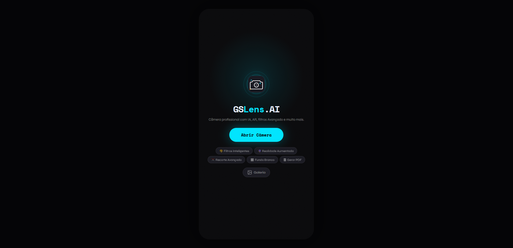

Projeto GSLeans.AI - CHALLENGE JOVI
===

Projeto do Challenge realizado em parceria com a JOVI durante a graduação na FIAP. Atuação em equipe no desenvolvimento de uma aplicação web multiplataforma com integração à câmera de dispositivos móveis.

## Informação
<br>

- Title:  `GSLeans.AI`
- Authors:  `Davyd Cristiano`, `Davi Sena`, `Christian Urbano`, `Thay`, `André`
- Full-preprint:
- 

## Linguagens
<br>

- HTML5
- CSS3
- Bootstrap 4.0 - Framework Front-End

<br>

## Direitos Reservados
```
Title: GSLeans.AI
Authors: Davyd Cristiano, Davi Sena, Christian Urbano, Thay, André.
```